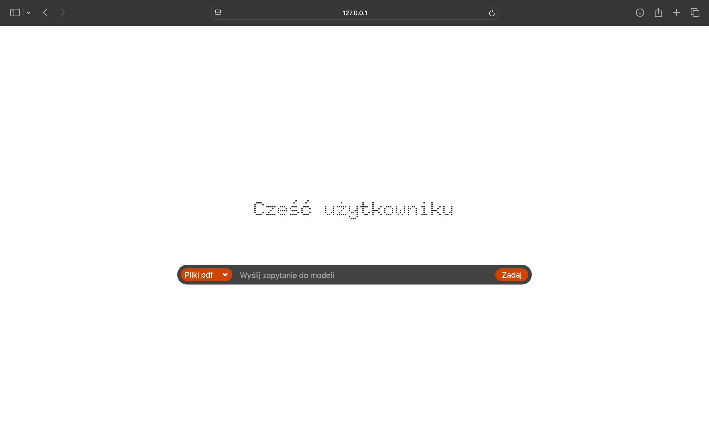
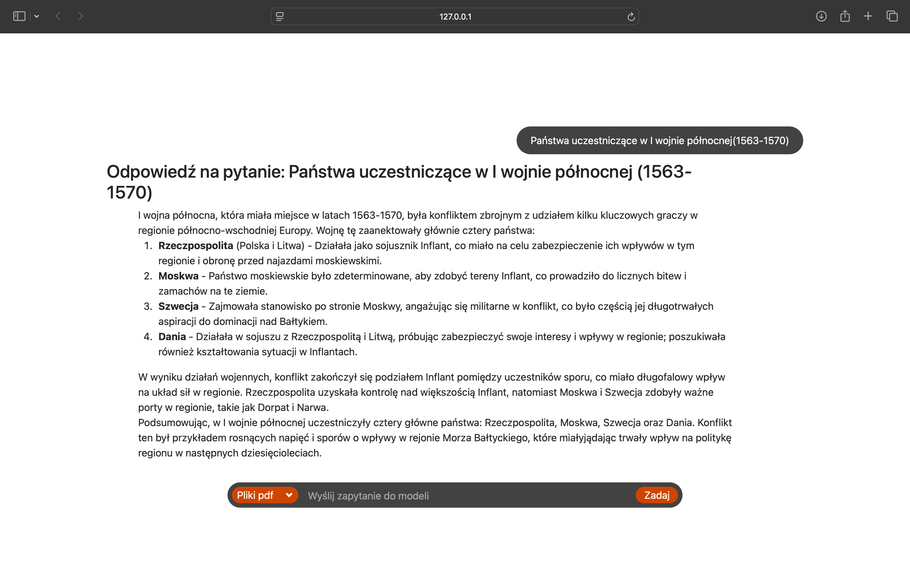

# 🎓 Chatbot Knowledge Base for Technikum programistyczne INFOTECH  

A chatbot designed to help students and staff quickly access the knowledge base of a technical college.  

## 📖 Features  
- 📚 Easy access to the knowledge base.  
- 🌐 Integrated with ChromaDB for efficient data storage and retrieval.  
- 🔒 Secure connection via SSH for protected communication.  
- ⚡ Fast and reliable Django-based web interface.  

---

## 🚀 Installation and Launch  

### 1. Clone the Repository  
```bash  
git clone https://github.com/your-username/your-repo.git  
cd your-repo  
```  

### 2. Install Dependencies  
Make sure you have Python 3 installed. Install required libraries:  
```bash  
pip install -r requirements.txt  
```  

### 3. Launch ChromaDB  
Run ChromaDB service:  
```bash  
chroma run --path src/chromadb --port 8001  
```  

### 4. Establish SSH Tunnel  
Replace `<username>` with your login and enter the password when prompted:  
```bash  
ssh -L 9999:10.192.168.112:8010 -p8007 <username>@10.192.168.112  
```  

### 5. Start the Chatbot App  
Run the application backend:  
```bash  
python3 src/app.py  
```  

### 6. Start the Web Interface  
Launch the Django server:  
```bash  
python3 site_QandA/manage.py runserver  
```  

---

## 🖼️ Screenshots  
Interface when you load the site:
 
Interface when you're using the site:
  
---

## 📂 Project Structure  
```plaintext  
├── content/
│   ├── pdfs/                                   # Folder with documents in pdf format
│   ├── pkls/                                   # Folder with files which include splitted documents
│   ├── plan_lekcji10.db                        # SQlite database with information from librus
├── src/  
│   ├── chromadb/                               # Chromadb files  
│   ├── preparing_data/
│   │   ├── xml_to_sql.py                       # Code for convert librus xml to sql
│   ├── templates/
│   │   ├── prompts.py                          # File with templates of prompts for models
│   ├── app.py                                  # Chatbot backend  
│   ├── bot.py                                  # Code for telegram bot in early version
│   ├── connect.py                              # For work with ollama deployed on server
│   ├── copy_ollama_function_ChatOllama.py      # File which helps to work LangChain with ollama deployed on server
├── site_QandA/                                 # Django web app  
│   ├── ...
├── .env                                        # File with env variables
├── requirements.txt                            # Python dependencies  
├── entrypoint.sh                               # sh code for start servers work in docker container
├── Dockerfile                                  # Dockerfile
├── docker-compose.yaml                         # docker-compose file
├── README.md                                   # Project documentation  
```  

---

## 🛠️ Contributing  
1. Fork the project.  
2. Create a feature branch: `git checkout -b feature-name`.  
3. Commit your changes: `git commit -m "Add feature"`.  
4. Push to the branch: `git push origin feature-name`.  
5. Open a pull request.  

---

## 📝 License  
This project is licensed under the [MIT License](LICENSE).  
